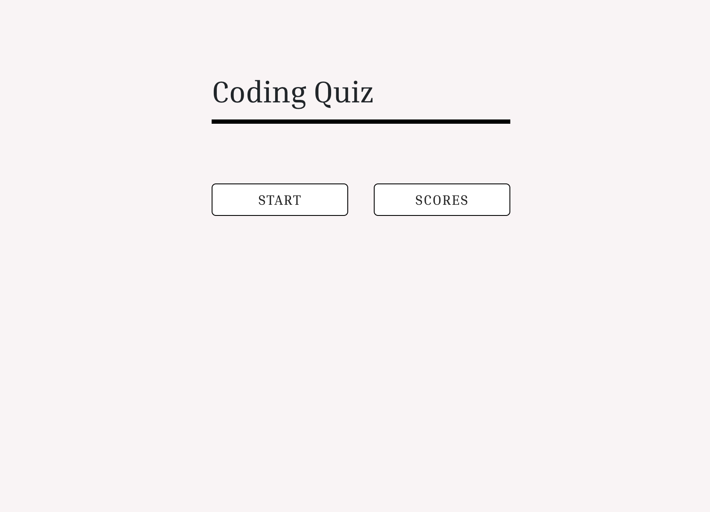
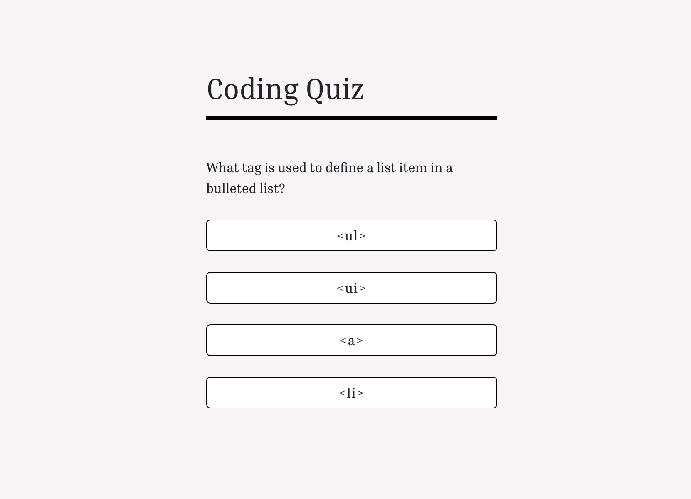
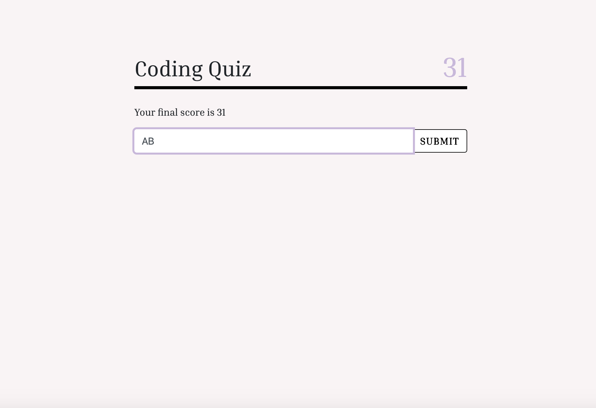
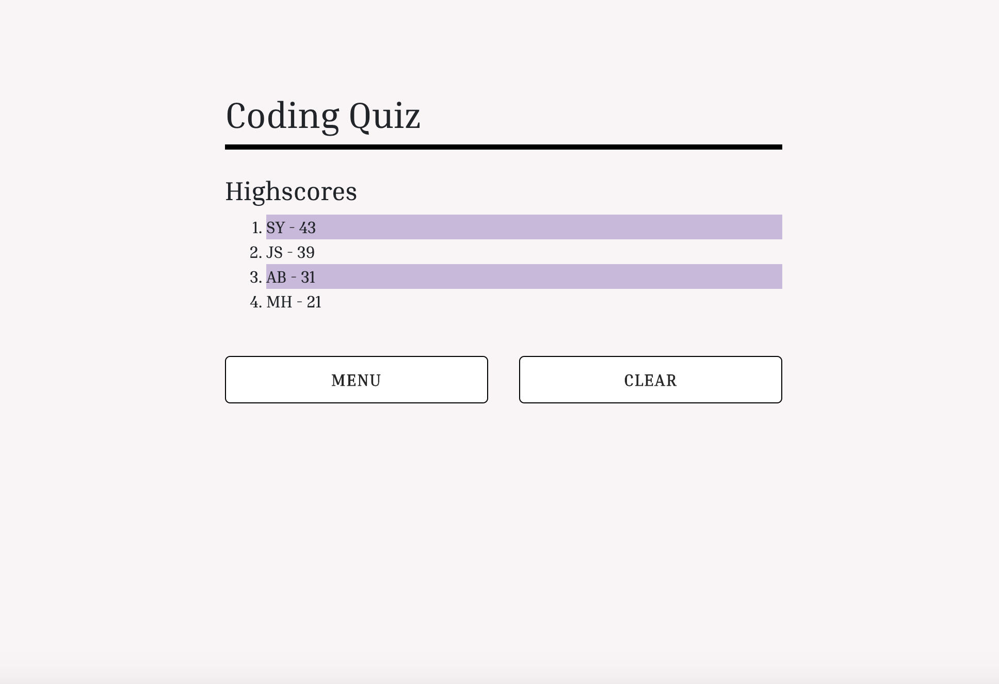

# Code Quiz

This project is intended to produce a multiple choice quiz. The quiz contains six questions related to HTML, CSS, and JavaScript. The user has 60 seconds to complete the quiz. If a question is answered incorrectly the timer is reduced by 10 seconds. Once all questions have been answered or if time runs out, the quiz ends and the final score is given. The resulting time left is the user’s final score.

# Getting Started

1. Click the START button
2. Timer begins and the first question with its set of choices are displayed
3. Once a choice is clicked the next question and set of choices are displayed
4. User may save the final score along with their initials at the end of the quiz
5. User is directed to the highscores page when the SUBMIT button is clicked
6. All highscores are stored in the browser and are displayed on the page in descending order
7. Click the MENU button to return the the start menu
8. Click the CLEAR button to remove all highscores and return to the start menu
9. Click the SCORES button in the start menu to view the highscores

# Built With

Bootstrap - https://getbootstrap.com/

# Link

https://atb5498.github.io/homework4/

